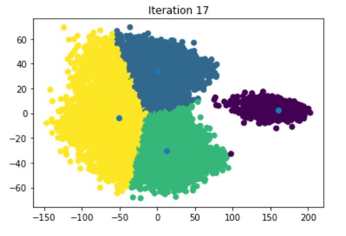

# FIFA-22-player-analysis

## Introduction
This project analyzes data on the players in the Career mode for FIFA 22. The dataset was gotten from [kaggle](https://www.kaggle.com/datasets/stefanoleone992/fifa-22-complete-player-dataset) (`players_22.csv`) and contains 19000+ players and 110 columns that represents different attributes of the players. Some of the columns are age, preferred foot, height, weight, nationality, club and a lot more columns that rate players on different skills.

In this project, I also implemented a KMeans clustering algorithm in order to cluster players according to their positions; Forwards, Midfielders, Defenders and Goalkeepers. I created an algorithm using python and pandas then compared the results to an implementation using scikit-learn.

## Data Wrangling
The dataset was cleaned for the most part. There were no null values for most of the well known players.

## Data Exploration
Here, I investigated some of the player attributes in order to get familiar with the dataset and see if there was any interesting finding.

## Observations
* Age distribution shows that players are typically around **20 to 30 years** old.
* Height distribution shows that players are generally around **170 to 190 cm** tall.
* Weight distribution shows that players generally weigh around **65 to 85 kg**.
* **76.3%** of players prefer using **right foot** to play.
* **Manchester City** has the most number of players, **11**, in the top 100 overall rated players.
* **Spain** has the most number of players, **15**, in the top 100 overall rated players.
* **The English Premier League** had more players than other leagues in the top 100 overall rated players.
* **Lionel Messi** is the player that has the highest overall rating.
* **The English Premier League** on average pays its players more in wages than any of the top 5 leagues.
* **Manchester City** and **Real Madrid** on average pays its players more in wages than any of the top clubs.

## Machine Learning - KMeans Clustering
K-means is an unsupervised machine learning technique that allow us to cluster data points. This enables us to find patterns in the data that can help us analyze it more effectively. K-means is an iterative algorithm, which means that it will converge to the optimal clustering over time.

To run a k-means clustering:

* Specify the number of clusters you want (usually referred to as k).
* Randomly initialize the centroid for each cluster. The centroid is the data point that is in the center of the cluster.
* Determine which data points belong to which cluster by finding the closest centroid to each data point.
* Update the centroids based on the geometric mean of all the data points in the cluster.
* Run steps 3 and 4 until the centroids stop changing. Each run is referred to as an iteration.

In this model, I used rating of players in different positions as the features for my KMeans algorithm. This meant that players that were forwards would have been rated higher for football positions that represented forwards and so on. I then implemented an algorithm by hand that goes through iterations and calculates the centroids for each of the 4 clusters using the geometric mean of the points in the cluster. I applied PCA (principal component analysis) to reduce the features to 2D and I visualized what the final clusters and centroid positions looked like.

After, I implemented the same algorithm using `KMeans` from `sklearn.cluster` and compared results.

## Extras
I also designed a dashboard in Power BI (because why not:upside_down_face:) that allows comparison of different players, their skills and other characteristics.

